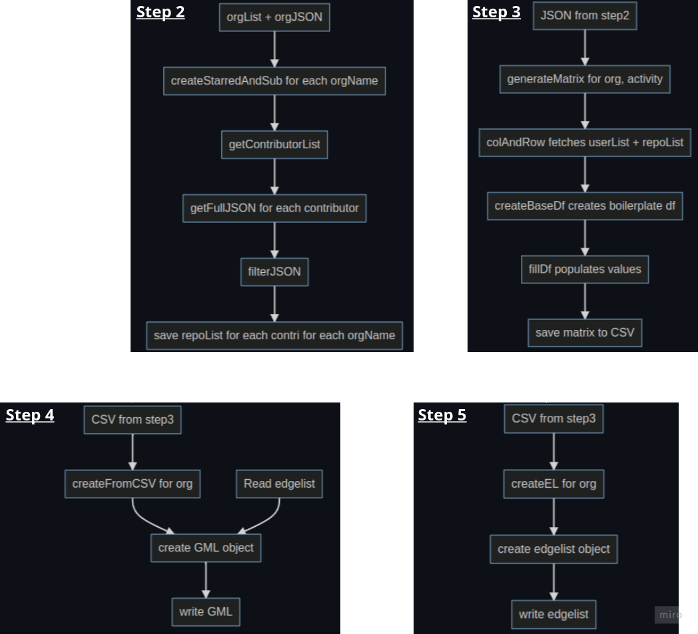

# User Interaction Behavior in Github Organizations: A Case Study on Reddit and 10gen
## Abstract
> GitHub organizations help developers to collaborate across repositories in an organization. Past studies on GitHub focused on user or repository-centric analysis with objectives such as evaluating contributions, code quality , identifying code duplicates  etc. However, only a limited number of them study GitHub organizations. Our final goal is to recommend users to repositories in the context of a GitHub organization, and so we are studying user-repository interactions in such a setting.
## Full Paper
[Final Submission](siamns'22_finalSubmission.pdf)
#### Find file >100M and add to .gitignore or use Git LFS
```bash
find ${pwd} -size +100M
```

## Steps
  

## Data Collection
  
