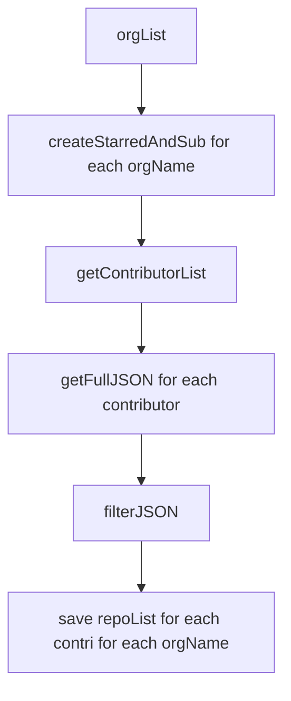

# Step 2 - Obtain Member Activity 
## `getRepoForContributor.py`
### Usage
 `python3 getRepoForContributor.py` _(with createStarredAndSub(orgName) in main)_
### Functions 
1) `getContributorList(orgName,source='../step1_obtainRepoDetails/data/repo_details/')` -> Opens the orgJSON and fetches the contributorList.
   1) Input Parameters
      1) **orgName** - Name of organisation (without `.json` extension or `10gen`)
      2) **source** - Path of folder containing JSON files. The default path is _step1_obtainRepoDetails/data/repo_details/_
   2) Returns
      1) **contributorList** - a sorted list that contains list of contributors, excluding users with key `login`
2) `getFullJSON(contributor, activityType)` -> API GET request at `https://api.github.com/users/` for given contributor and activityType and return the list of repos. _(Note: GitHub displays 30 repos per page, the functions reiterates until `None` returned)_
   1) Input Parameters
      1) **contributor** - GitHub ID of the contributor
      2) **activityType** - _starred_ or _subscriptions_
   2) Returns
      1) **fullList** - a sorted list that contains list of contributors, excluding users with key `login`
3) `filterJSON(unfilteredList)` -> Removes values with keys `license` and `owner`
   1) Input Parameters
      1) **unfilteredList** - contains all the keys 
   2) Returns
      1) **filteredList** - filtered list
4) `createStarredAndSub(orgName, dest='data/test/)` -> Control function that calls other functions to generate `orgName.JSON`
   1) Input Parameters 
      1) **orgName** - Name of organisation (without `.json` extension or `10gen`)
      2) **dest** - Path of destination directory. The default path is _data/test/_  
   2) Returns 
      1) **None** - a JSON file is formed in the destination directory
### Flow 

