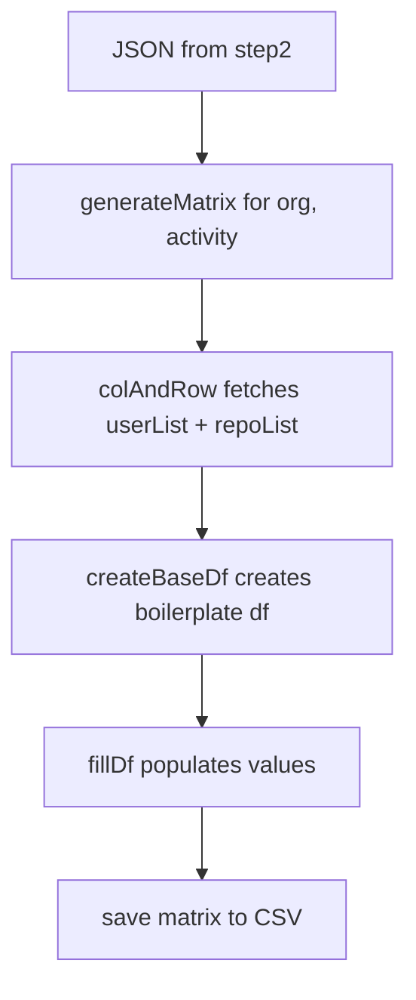

# Step 2 - Obtain Member Activity 
## `matrix.py`
### Usage
 `python3 matrix.py` _(with generateMatrix(org, activity) in main)_
### Functions 
1) `colAndRow(org, activityType,path='../step2_obtainMemberActivity/data/test/')` -> Open orgName.json from step2 and returns list of users and repos (which are rows and cols respectively).
   1) Input Parameters
      1) **org** - Name of organisation (without `.json` extension or `10gen`)
      2) **activityType** - _starred_ or _subscriptions_
      3) **path** - Path of folder containing JSON files. The default path is ../step2_obtainMemberActivity/data/test/_
   2) Returns
      1) **list(userSet)** - a distinct list of userIDs
      2) **list(repoSet)** - a distinct list of repoIDs
      3) **orgJSON** - JSON loaded for given orgName
2) `createBaseDf(userList, repoList)` -> uses pandas.DataFrame() to create a boilerplate dateframe
   1) Input Parameters
      1) **userList** - a distinct list of userIDs
      2) **repoList** - a distinct list of repoIDs
   2) Returns
      1) **baseDf** - boilerplate dataframe with columns=repoList and rows=userList and values=0
3) `fillDf(orgJSON, baseDf, activityType)` -> Populates values in baseDf (from previous function)
   1) Input Parameters
      1) **orgJSON** - JSON loaded for given orgName
      2) **baseDf** - boilerplate dataframe from previous function
      3) **activityType** - _starred_ or _subscriptions_
   2) Returns 
      1) **baseDf** - updated dataframe with 1 for (user, repo) if the user has starred/subscribed to the repo; else 0 

4) `generateMatrix(org, activityType)` -> Controller function that outputs CSV file
   1) Input Parameters 
      1) **org** - Name of organisation (without `.json` extension or `10gen`)
      2) **activityType** - _starred_ or _subscriptions_
   2) Returns 
      1) **None** - But a CSV file is formed in the `data/matrix_user_repo/+activityType+/+org+.csv`
### Dependency
1) General 
   1) `json` -> JSON read/write
   2) `pandas` -> Dataframes 

### Flow 

