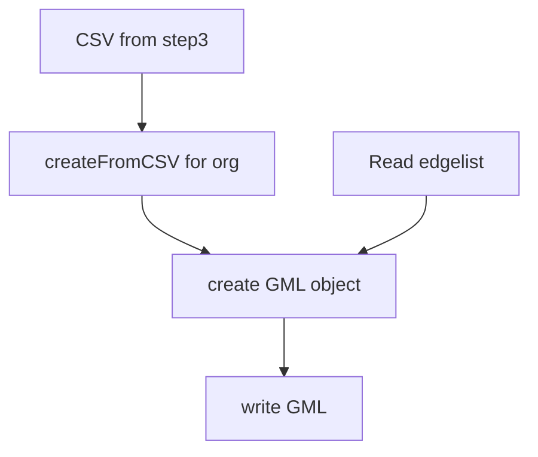

# Step 5 - Creating user-user interaction edgelist

## `createUserUserEL.py`

### Usage

`python3 createGML.py` _(with createFromCSV(org, activity) in main)_

### Functions

1. `createFromCSV(orgName, activityType, source='../step3_convertJSONToMatrix/data/matrix_user_repo/', destDir='data/gml/user-repo-GML')` -> Open orgName.csv from step3 and writes a GML file to destDir.
   1. Input Parameters
      1. **orgName** - Name of organisation (without `.csv` extension or `10gen`)
      2. **activityType** - _starred_ or _subscriptions_
      3. **source** - Path of folder containing CSV files. The default path is _../step3_convertJSONToMatrix/data/matrix_user_repo/_
      4. **destDir** - Path of folder to store GML files. The default path is _data/gml/user-repo-GML_
   2. Returns
      1. **None** - But writes a GML file to _destDir_
2. `createFromEL(orgName, activityType, source='gml/user-user-EL/', destDir='gml/user-user-GML/')` -> Reads edgelist from source and writes it to GML file to destDir
   1. Input Parameters
      1. **orgName** - Name of organisation (without `.csv` extension or `10gen`)
      2. **activityType** - _starred_ or _subscriptions_
      3. **source** - Path of folder containing CSV files. The default path is _../step3_convertJSONToMatrix/data/matrix_user_repo/_
      4. **destDir** - Path of folder to store GML files. The default path is _data/gml/user-repo-GML_
   2. Returns
      1. **None** - But writes a GML file to _destDir_

### Dependency

1. General
   1. `networkx` -> Creating GML object
   2. `pandas` -> Dataframes

### Flow

