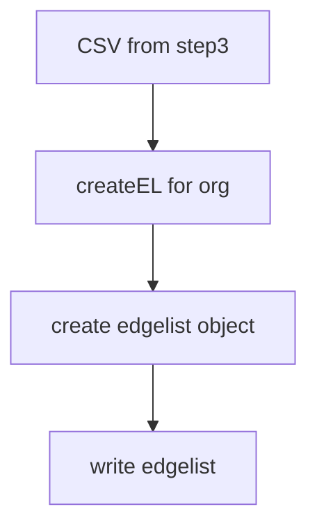

# Step 5 - Creating user-user interaction edgelist

## `createUserUserEL.py`

### Usage

`python3 createUserUserEL.py` _(with createEL(org, activity) in main)_

### Functions

1. `createEL(org, activityType, source='../step3_convertJSONToMatrix/data/matrix_user_repo/', dest='../step4_convertMatrixToB_xGraphs/data/gml/user-user-EL/')` -> Open orgName.csv from step3 and writes it to edgelist file.
   1. Input Parameters
      1. **org** - Name of organisation (without `.csv` extension or `10gen`)
      2. **activityType** - _starred_ or _subscriptions_
      3. **source** - Path of folder containing CSV files. The default path is _../step3_convertJSONToMatrix/data/matrix_user_repo/_
      4. **dest** - Path of folder to store GML files. The default path is _../step4_convertMatrixToB_xGraphs/data/gml/user-user-EL/_
   2. Returns
      1. **None** - But writes an edgelist file to _destDir_
### Dependency

1. General
   1. `itertools` -> Creating indices combinations in dataframe
   2. `pandas` -> Dataframes
   3. `os` -> Check if edgelist already present

### Flow

