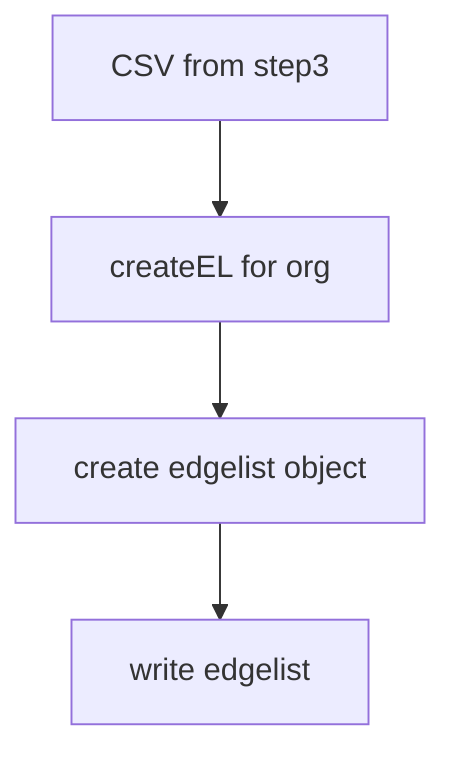

# Step 6 - Community detection + Clustering Coefficient + Plots

## `louvain.py`

### Usage

`python3 louvain.py` _(with findCommunity(org, activity) in main)_

### Functions

1. `createFromEL(orgName, activityType, source='../step4_convertMatrixToB_xGraphs/data/gml/user-user-EL/', destDir='data/user-user-GML/')` -> Helper function to convert edgelist to GML.
   1. Input Parameters
      1. **orgName** - Name of organisation (without `.csv` extension or `10gen`)
      2. **activityType** - _starred_ or _subscriptions_
      3. **source** - Path of folder containing edgelist files. The default path is _../step4_convertMatrixToB_xGraphs/data/gml/user-user-EL/_
      4. **destDir** - Path of folder to store GML files. The default path is _data/user-user-GML/_
   2. Returns
      1. **None** - But writes an GML file to _destDir_
### Dependency

1. General
   1. `networkx` -> Reading edgelist and writing to GML

## `clusteringCoefficient.py`

### Usage

`python3 clusteringCoefficient.py` _(with calcClusteringCoefficient(org, activity) in main)_

### Functions

1. `calcClusteringCoefficient(orgName, activityType, source='../step4_convertMatrixToB_xGraphs/data/gml/user-repo-GML/', dest='data/plots/')` -> Plots clustering coefficient (aka P14) from GML file 
   1. Input Parameters
      1. **orgName** - Name of organisation (without `.csv` extension or `10gen`)
      2. **activityType** - _starred_ or _subscriptions_
      3. **source** - Path of folder containing GML files. The default path is _../step4_convertMatrixToB_xGraphs/data/gml/user-repo-GML/_
      4. **destDir** - Path of base folder to store GML files. The default path is _data/plots/_
   2. Returns
      1. **None** - But saves P14 to orgFolder in destDir
### Dependency

1. General
   1. `networkx` -> Reading GML file
   2. `netwrokx.algorithms.bipartite` -> bipartite clustering post reading GML file
   3. `math` -> Max and Min clustering values
   4. `numpy` -> bins for range of clustering coefficient values
   5. `matplotlib.pyplot` -> Plotting and saving the data
   
## `degreeDistribution.py`

### Usage

`python3 degreeDistribution.py` _(with allForOrg(org) in main)_

### Functions

1. `genIndiPlots(orgName, userDict, repoDict, activityType, dest='data/plots/')` -> Generates user vs numOfRepos + repo vs numOfUsers plots (aka P9, P10, P11, P12)  
   1. Input Parameters
      1. **orgName** - Name of organisation (without `.csv` extension or `10gen`)
      2. **userDict** - Dictionary with key:user::value:degree
      3. **repoDict** - Dictionary with key:repo::value:degree
      4. **activityType** - _starred_ or _subscriptions_
      5. **source** - Path of folder containing GML files. The default path is _../step4_convertMatrixToB_xGraphs/data/gml/user-repo-GML/_
      6. **destDir** - Path of base folder to store the plots. The default path is _data/plots/_
   2. Returns
      1. **None** - But saves P9+P11 or P10+P22 (in accordance to activityType) to orgFolder in destDir

   
2. `genP1toP4(orgName, userDegree, repoDegree, dest='data/plots/')` -> Generates P1+P2+P5 or P3+P4+P6 plots (in accordance to activityType); fetches activityType from orgName  
   1. Input Parameters
      1. **orgName** - Name of organisation (without `.csv` extension or `10gen`)
      2. **userDegree** - Degree of users (from bipartite graph)
      3. **repoDegree** - Degree of repos (from bipartite graph)
      4. **dest** - Path of base folder to store the plots. The default path is _data/plots/_
   2. Returns
      1. **None** - But saves P1+P2+P5 or P3+P4+P6 plots (in accordance to activityType) to orgFolder in dest

3. `P7toP8(orgName, activityType, source='../step5_convertB_xGraphsToG_xGraphs/data/user-user-EL/', dest='data/plots/')` -> Generates overall network graph (aka P7 and P8 plots, in accordance to activityType)
   1. Input Parameters
      1. **orgName** - Name of organisation (without `.csv` extension or `10gen`)
      2. **activityType** - _starred_ or _subscriptions_
      3. **source** - Path of folder containing GML files. The default path is _../step5_convertB_xGraphsToG_xGraphs/data/user-user-EL/_
      4. **dest** - Path of base folder to store the plots. The default path is _data/plots/_
   2. Returns
      1. **None** - But saves P7_G_w or P8_G_s 
   
4. `calcDegreeDist(orgName, ,activityType, source)` -> Reads the GML file and  generates userDegree, repoDegree, repoDict, userDict    
   1. Input Parameters
      1. **orgName** - Name of organisation (without `.gml` extension or `10gen`) 
      2. **activityType** - _starred_ or _subscriptions_
      3. **source** - Path of folder containing GML files.
   2. Returns
      1. **userDegree** - List of user degrees 
      2. **repoDegree** - List of repo degrees 
      3. **userDict** - Dictionary with key:user::value:degree
      4. **repoDict** - Dictionary with key:repo::value:degree
5. `calcDegreeAndPlot(org)` -> calls calcDegreeDist(), stores respective dicts to JSON files and calls genP1toP4() and genIndiPlots()    
   1. Input Parameters
      1. **org** - Name of organisation (without `.gml` extension or `10gen`) 
   2. Returns
      1. **None** 
   
6. `calcDegreeDist(orgName, ,activityType, source)` -> Reads the GML file and  generates userDegree, repoDegree, repoDict, userDict    
   1. Input Parameters
      1. **orgName** - Name of organisation (without extension or `10gen`) 
      2. **activityType** - _starred_ or _subscriptions_
      3. **source** - Path of folder containing GML files.
   2. Returns
      1. **userDegree** - List of user degrees 
      2. **repoDegree** - List of repo degrees 
      3. **userDict** - Dictionary with key:user::value:degree
      4. **repoDict** - Dictionary with key:repo::value:degree

7. `allForOrg(org)` -> Controller function to initiate and subsequently call other programs    
   1. Input Parameters
      1. **org** - Name of organisation (with `.gml` extension or `10gen`), this function handles stripping of the extension
   2. Returns
      1. **None** 
   
### Dependency

1. General
   1. `matplotlib.pyplot` -> Plotting and saving the data
   2. `os` -> Check file paths and make directories
   3. `networkx` -> Handle GML and edgelist files
   4. `numpy` -> Unique values and list computations
   5. `json` -> JSON read/write
   6. `operator` -> search in dict using _operator.itemgetter(arg)_
   7. `time` -> Performance metrics 
### Flow

