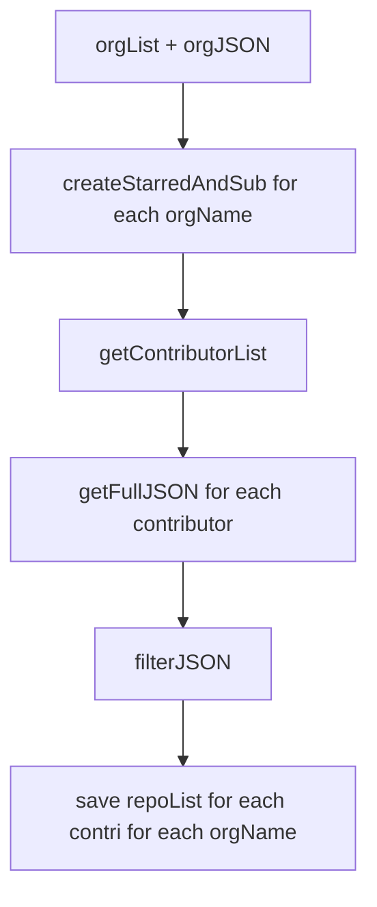
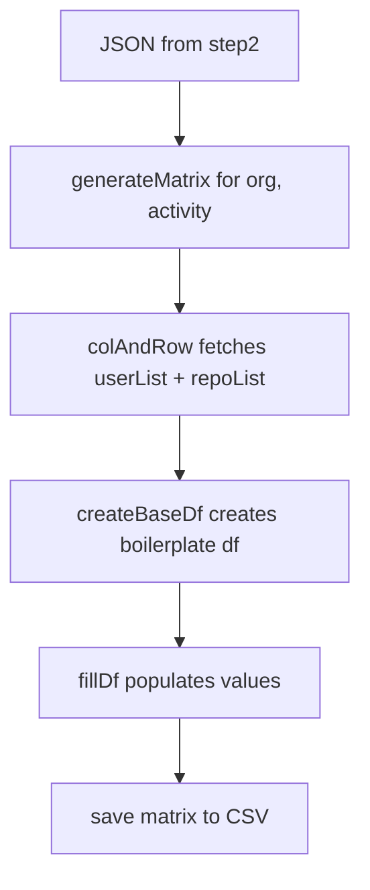

# Step 2 - Obtain Member Activity 
## `getRepoForContributor.py`
### Usage
 `python3 getRepoForContributor.py` _(with createStarredAndSub(orgName) in main)_
### Functions 
1) `getContributorList(orgName,source='../step1_obtainRepoDetails/data/repo_details/')` -> Opens the orgJSON and fetches the contributorList.
   1) Input Parameters
      1) **orgName** - Name of organisation (without `.json` extension or `10gen`)
      2) **source** - Path of folder containing JSON files. The default path is _../step1_obtainRepoDetails/data/repo_details/_
   2) Returns
      1) **contributorList** - a sorted list that contains list of contributors, excluding users with key `login`
2) `getFullJSON(contributor, activityType)` -> API GET request at `https://api.github.com/users/` for given contributor and activityType and return the list of repos. _(Note: GitHub displays 30 repos per page, the functions reiterates until `None` returned)_
   1) Input Parameters
      1) **contributor** - GitHub ID of the contributor
      2) **activityType** - _starred_ or _subscriptions_
   2) Returns
      1) **fullList** - a sorted list that contains list of contributors, excluding users with key `login`
3) `filterJSON(unfilteredList)` -> Removes values with keys `license` and `owner`
   1) Input Parameters
      1) **unfilteredList** - contains all the keys 
   2) Returns
      1) **filteredList** - filtered list
4) `createStarredAndSub(orgName, dest='data/test/)` -> Controller function that calls other functions to generate `orgName.JSON`
   1) Input Parameters 
      1) **orgName** - Name of organisation (without `.json` extension or `10gen`)
      2) **dest** - Path of destination directory. The default path is _data/test/_  
   2) Returns 
      1) **None** - But a JSON file is formed in the destination directory
### Dependency
1) General 
   1) `requests` -> API Requests
   2) `json` -> JSON read/write
   3) `sys` -> importing project files from another directory 
   4) `time` -> Performance metrics
2) Project 
   1) `apiRobin` -> Parse config file 
   2) `getRandomAPIToken` -> Obtain API Token
### Flow 

# Step 3 - Matrix generation 
## `matrix.py`
### Usage
 `python3 matrix.py` _(with generateMatrix(org, activity) in main)_
### Functions 
1) `colAndRow(org, activityType,path='../step2_obtainMemberActivity/data/test/')` -> Open orgName.json from step2 and returns list of users and repos (which are rows and cols respectively).
   1) Input Parameters
      1) **org** - Name of organisation (without `.json` extension or `10gen`)
      2) **activityType** - _starred_ or _subscriptions_
      3) **path** - Path of folder containing JSON files. The default path is ../step2_obtainMemberActivity/data/test/_
   2) Returns
      1) **list(userSet)** - a distinct list of userIDs
      2) **list(repoSet)** - a distinct list of repoIDs
      3) **orgJSON** - JSON loaded for given orgName
2) `createBaseDf(userList, repoList)` -> uses pandas.DataFrame() to create a boilerplate dateframe
   1) Input Parameters
      1) **userList** - a distinct list of userIDs
      2) **repoList** - a distinct list of repoIDs
   2) Returns
      1) **baseDf** - boilerplate dataframe with columns=repoList and rows=userList and values=0
3) `fillDf(orgJSON, baseDf, activityType)` -> Populates values in baseDf (from previous function)
   1) Input Parameters
      1) **orgJSON** - JSON loaded for given orgName
      2) **baseDf** - boilerplate dataframe from previous function
      3) **activityType** - _starred_ or _subscriptions_
   2) Returns 
      1) **baseDf** - updated dataframe with 1 for (user, repo) if the user has starred/subscribed to the repo; else 0 

4) `generateMatrix(org, activityType)` -> Controller function that outputs CSV file
   1) Input Parameters 
      1) **org** - Name of organisation (without `.json` extension or `10gen`)
      2) **activityType** - _starred_ or _subscriptions_
   2) Returns 
      1) **None** - But a CSV file is formed in the `data/matrix_user_repo/+activityType+/+org+.csv`
### Dependency
1) General 
   1) `json` -> JSON read/write
   2) `pandas` -> Dataframes 

### Flow 

